# 🌸 SakurApp - 2026
> **Trabajo Final Integrador (TFI)**  
> **Universidad Tecnológica Nacional - Facultad Regional Avellaneda (UTN FRA)**  
> **Grupo:** Sakura  
> **Repositorio:** `sakurapp-2026`


---

## Integrantes y Backlog

La planificación, fechas de inicio/finalización, branches y detalle de historias de usuario se gestionan centralizadamente en el **Backlog oficial de GitHub Projects**:

* 📌 **Tablero de Proyecto & Backlog:** [GitHub Projects - Tablero Sakura](https://github.com/users/ferlautaro2001/projects/2)
* 🎫 **Gestión de Incidencias & User Stories:** [Issues del Repositorio](https://github.com/ferlautaro2001/sakurapp-2026/issues)

| Integrante | Rol |
| :--- | :--- |
| **Fernandez Di Bella, Lautaro Alfredo** | Líder de Proyecto  
---

## Tech Stack

<p align="left">
  
  
  
  
  
  
  
  
</p>

* **Framework & UI:** Angular 22 (Standalone Components) & Ionic 9 (`@ionic/angular`)
* **Mobile Runtime & Hardware:** Capacitor 8 (Cámara, Lector de Códigos de Barra/QR, Hápticos, Notificaciones)
* **Backend & Autenticación:** Firebase Authentication & Cloud Firestore / Data Connect / SQL Connect
* **Lenguajes & Estilos:** TypeScript 6, HTML5, SCSS/CSS3, Tailwind CSS & Font Awesome


---

## Índice Visual de Pantallas e Imágenes

A continuación se indexan las capturas de pantalla de los flujos y componentes de la aplicación, disponibles en el directorio [`visuals/`](./visuals):

### 1. Paleta & Componentes

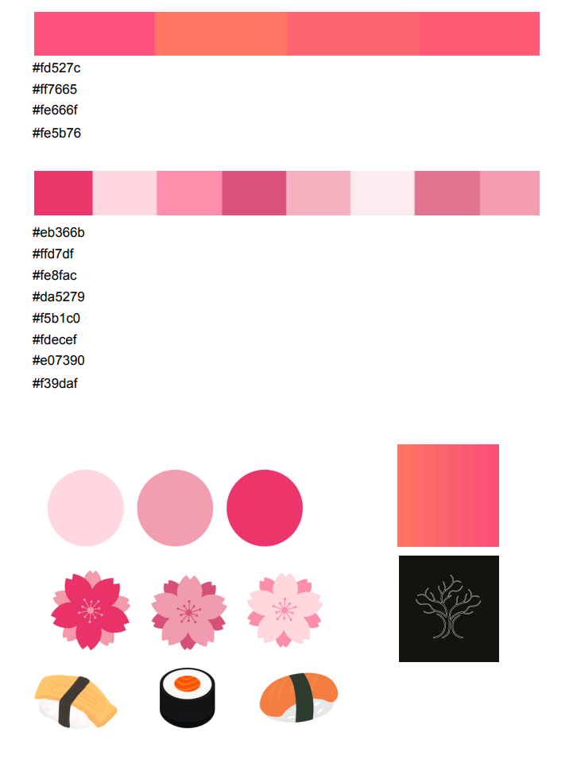


### 2. Acceso y Presentación

| Pantalla | Descripción | Captura |
| :--- | :--- | :---: |
| **Splash Dinámico** | Pantalla de carga animada con isotipo Sakura. | 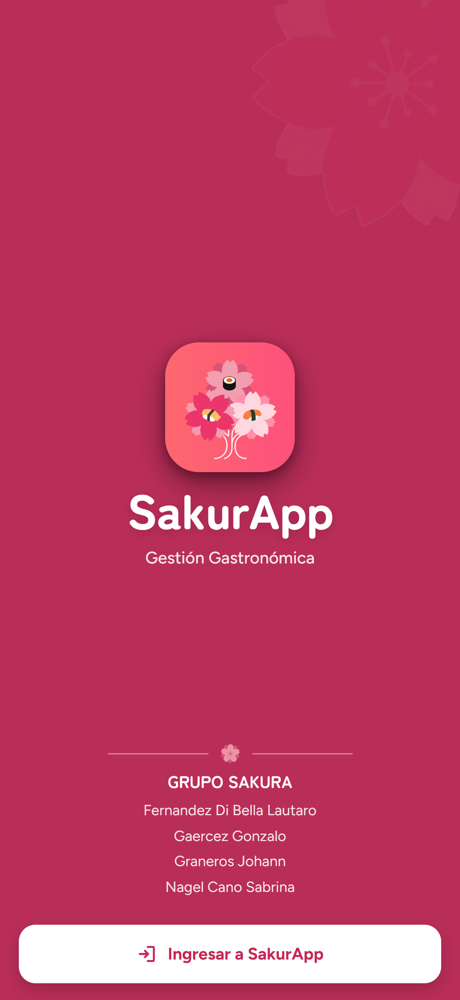 |
| **Presentación Estática** | Portada y bienvenida institucional a SakurApp. |  |
| **Inicio de Sesión** | Pantalla de login con tarjetas de accesos rápidos por perfil. | 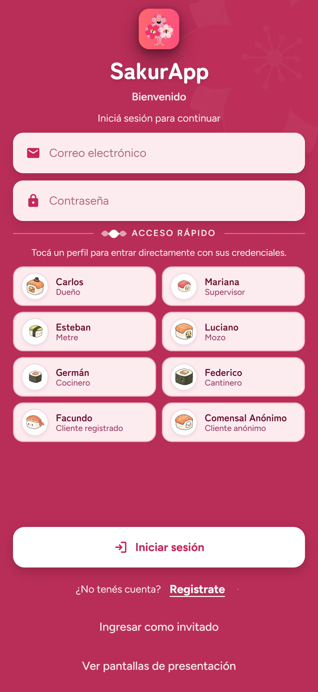 |
| **Error de Validación** | Feedback visual interactivo ante errores de validación. | 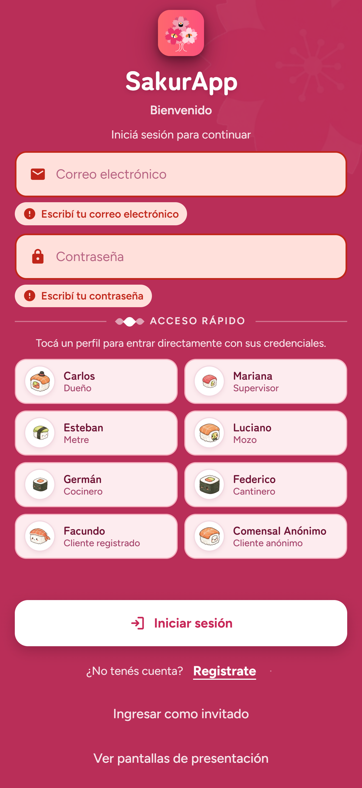 |
| **Cierre de Sesión** | Modal de confirmación para deslogueo seguro. | 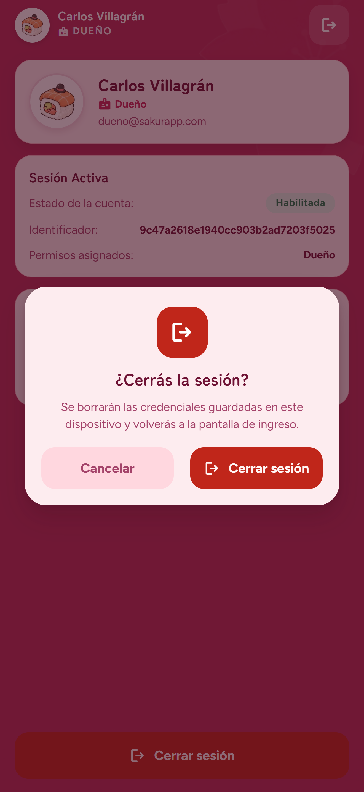 |

### 2. Registro y Estados de Cuenta

| Pantalla | Descripción | Captura |
| :--- | :--- | :---: |
| **Registro de Cliente** | Formulario completo con lector de DNI y captura de foto de perfil. | 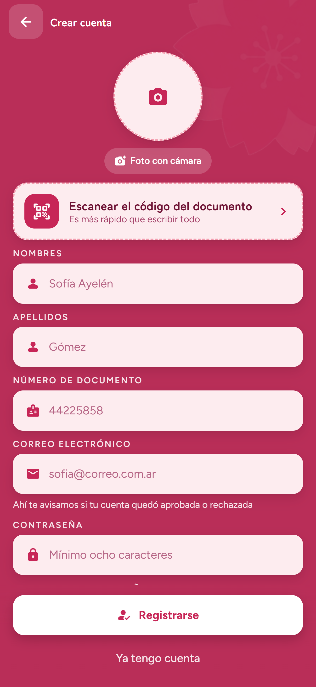 |
| **Registro Enviado** | Confirmación de solicitud enviada a los administradores. | 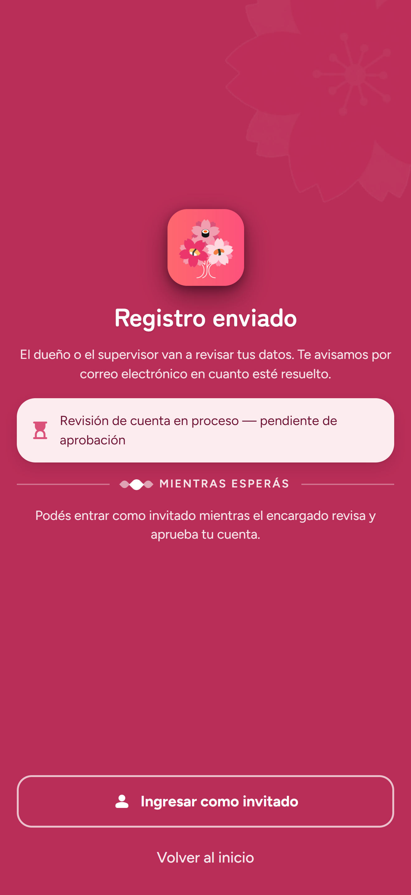 |
| **Registro de Invitado** | Alta ágil de cliente anónimo presencial (nombre y foto). | 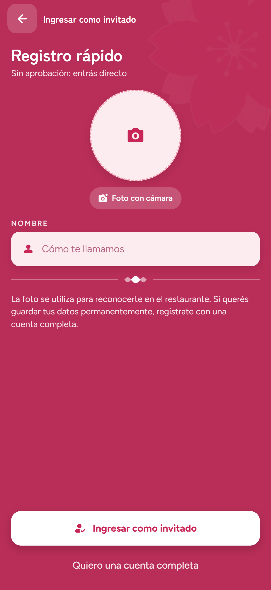 |
| **Cuenta Pendiente** | Pantalla informativa para clientes a la espera de aprobación. | 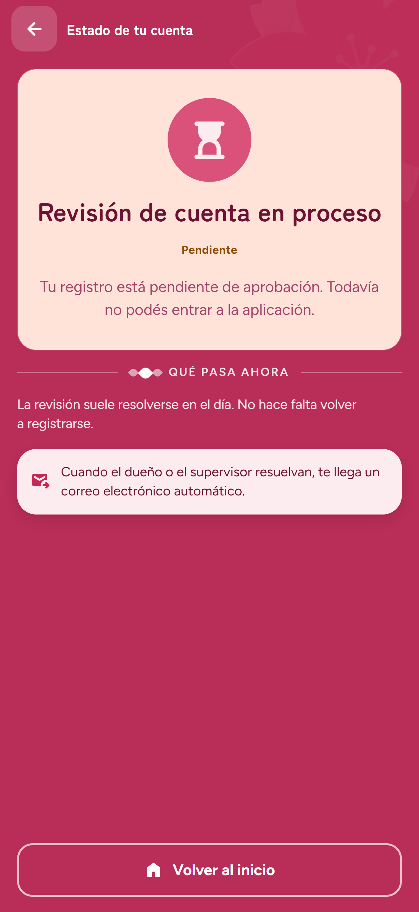 |
| **Cuenta Rechazada** | Pantalla informativa para clientes cuya solicitud fue denegada. | 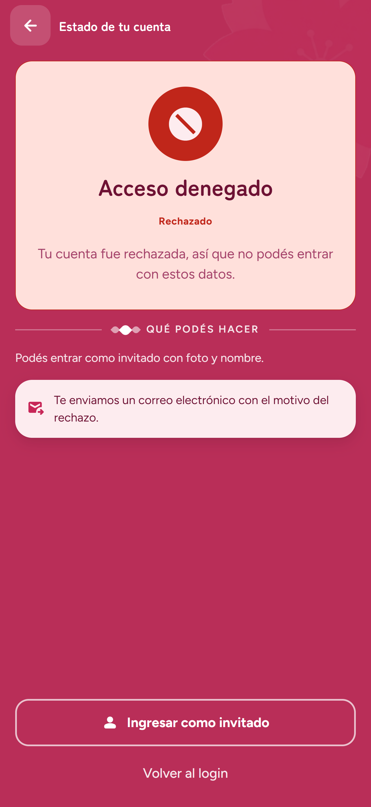 |

### 3. Dashboard Principal

| Pantalla | Descripción | Captura |
| :--- | :--- | :---: |
| **Home de Sesión** | Dashboard principal con navegación contextual según el perfil de usuario. | 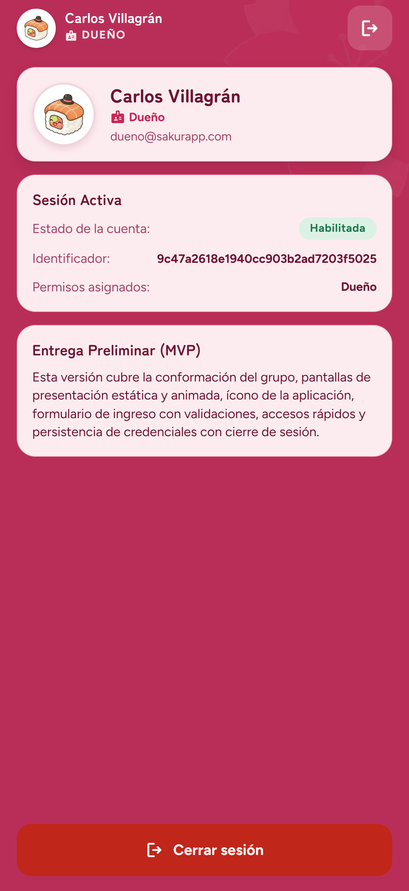 |

---

## Catálogo de Códigos QR del Sistema

Códigos QR funcionales requeridos por la cátedra para pruebas y corrección desde la aplicación:

| Tipo de QR | Propósito / Acción | Código QR |
| :--- | :--- | :---: |
| **Ingreso al Local** | Registro en lista de espera y visualización de encuestas. | *A completar próximo sprint* |
| **Mesa 1 (Estándar)** | Asignación y pedidos de mesa estándar. | *A completar próximo sprint* |
| **Mesa 2 (VIP)** | Asignación y pedidos de mesa VIP. | *A completar próximo sprint* |
| **Mesa 3 (Mov. Reducida)** | Asignación y pedidos de mesa con movilidad reducida. | *A completar próximo sprint* |
| **Propina Excelente (20%)** | Registrar 20% de propina. | *A completar próximo sprint* |
| **Propina Muy Bueno (15%)** | Registrar 15% de propina. | *A completar próximo sprint* |
| **Propina Bueno (10%)** | Registrar 10% de propina. | *A completar próximo sprint* |
| **Propina Regular (5%)** | Registrar 5% de propina. | *A completar próximo sprint* |
| **Propina Malo (0%)** | Registrar 0% de propina. | *A completar próximo sprint* |
| **Lector DNI (Prueba)** | Lector de código de barras DNI argentino para registro. | *A completar próximo sprint* |

---

## 🚀 Instalación y Puesta en Marcha

### Prerrequisitos
* Node.js (v20+ recomendado)
* npm
* Android Studio (con Android SDK y emulador o dispositivo físico configurado)

### 1. Clonar e instalar dependencias
```bash
git clone https://github.com/ferlautaro2001/sakurapp-2026.git
cd sakurapp-2026
npm install
```

### 2. Variables de entorno
Copiar la plantilla de ejemplo para generar el archivo local `.env`:
```bash
cp .env.example .env
```
*(Completar con las credenciales de Firebase y Data Connect si es necesario).*

---

## 📱 Cómo Levantar en Android Studio

> [!NOTE]
> La plataforma nativa ya está completamente integrada en la carpeta `android/` del repositorio (no es necesario ejecutar `npx cap add android`).

### Opción A: Comando automático todo-en-uno (Recomendado)
Compila la web, inyecta las variables de entorno, sincroniza con Capacitor y abre Android Studio de forma automática:
```bash
npm run android
```

### Opción B: Paso a paso por consola
```bash
# 1. Compilar la aplicación web de Angular (dispara prebuild y set-env)
npm run build

# 2. Sincronizar el bundle compilado y plugins con Android nativo
npx cap sync android

# 3. Abrir el proyecto en Android Studio
npx cap open android
```

### Pasos dentro de Android Studio:
1. Al abrir, esperar unos segundos a que finalice la sincronización inicial de Gradle (**Gradle Sync**).
2. Seleccionar un emulador virtual (AVD) o tu dispositivo físico conectado con depuración USB.
3. Presionar el botón **Run 'app' (▶️)** en la barra superior (o presionar `Shift + F10`).

> [!TIP]
> **Generar APK debug por terminal:**
> Podés compilar directamente el archivo `.apk` sin abrir la interfaz gráfica de Android Studio ejecutando:
> ```bash
> npm run android:apk
> ```
> El instalable se generará en: `android/app/build/outputs/apk/debug/app-debug.apk`.

---

## 🌐 Ejecución en Navegador Web (Desarrollo)

Para probar la aplicación en el navegador localmente:
```bash
npm start
```

